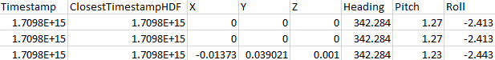

# GPS synchronization tool (FICOSA)

## Prerequisites:

#### FFmpeg: https://ffmpeg.org/download.html

#### Colmap: https://colmap.github.io/

## Run:

1. Run to preprocess the images
   
 `python preprocess.py --main-folder /path/to/main/folder --output-folder /path/to/output/folder --input-type {video, images} --input-folder /path/to/input_images/folder`
 
2. Run to create the csv files and the colmap folder
   
`python GPS_sync.py --main-folder <path_to_main_folder> --folder-cam <path_to_camera_folder> --total-frames <number_of_frames> --threshold-min <minimum_threshold> --threshold-max <maximum_threshold> --colmap-path <path_to_colmap_output_file>`

## Help:
#### preprocess
* main-folder: Path to the main folder ---> example: \FICOSA\VideoServer_DYMOS_VX\RealWorld\20240307_085658 
* output-folder: Path to the outputput folder to save the processed images
* input-type: 1)video: Extract frames from the Ficosa's video, 2)images: Assume that images are extracted and properly named
* input-folder: If input-type==images it is the folder that contains them

#### GPS_sync
* main-folder: Path to the main folder ---> example: \FICOSA\VideoServer_DYMOS_VX\RealWorld\20240307_085658 
* folder-cam: Path to the folder containing camera CSV files
* total-frames: Number of frames to extract
* threshold-min: Minimum threshold for closest times
* threshold-max: Maximum threshold for closest times
*colmap-path: Path to the output Colmap text file 

## Outputs of the tool:
* __4 csv files__ (0_cam, 1_cam, 2_cam, 3_cam) each corresponding to 1 of the 4 cameras (front,right,left,back).
  
  
* __colmap folder__ that contains images.txt, cameras.txt, points3D.txt. These are needed in order to load the sparse model in colmap. 

